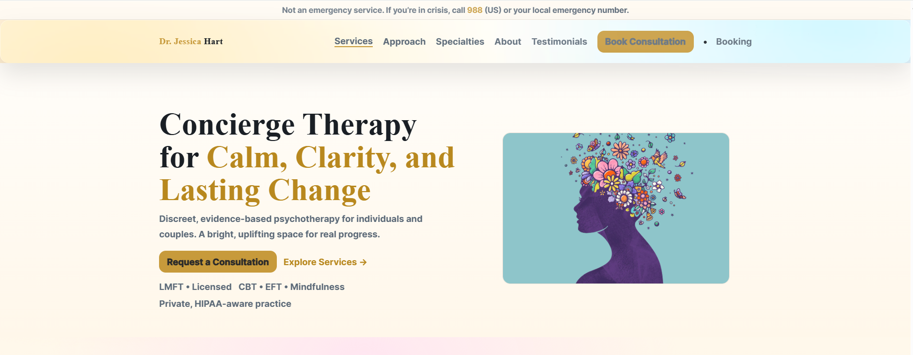
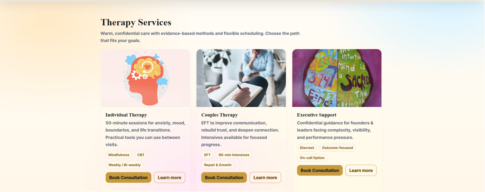
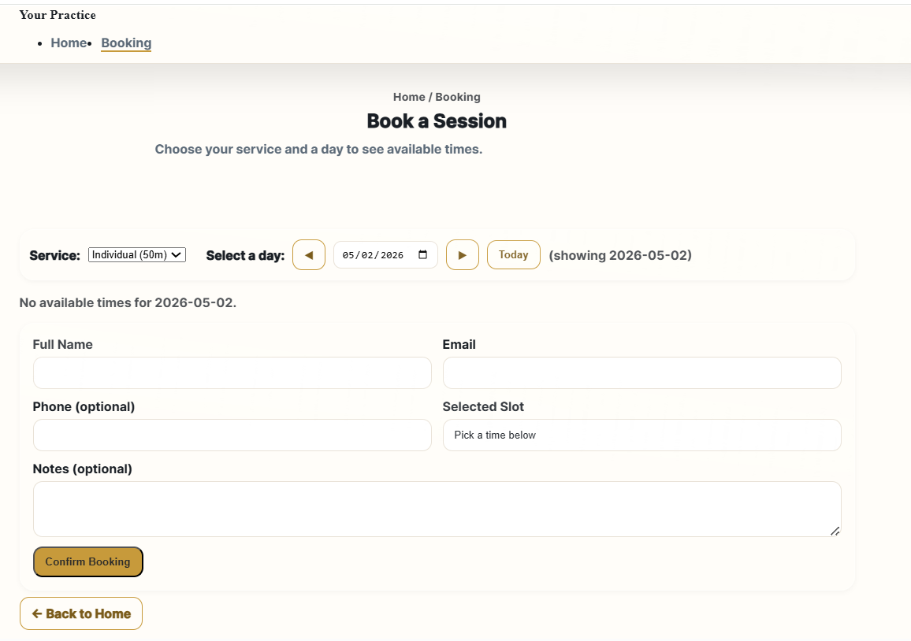

# Therapist Booking Website

Full-stack therapy practice website featuring consultation booking, admin-managed availability, Express API routes, and SQLite persistence.

---

## Preview

### Homepage Hero Section


### Services Section


### Booking Page


---

## Overview

Therapist Booking Website is a responsive full-stack web application designed for a therapy practice. It includes a polished public-facing website, service information, consultation booking flow, and backend functionality for managing availability and booking requests.

The project demonstrates frontend UI development, backend API routing, SQLite data persistence, and full-stack application structure.

---

## Features

- Responsive therapy practice website
- Consultation booking flow
- Admin-managed availability
- Express.js backend API
- SQLite data storage
- Email notification support
- Organized frontend, backend, booking, and admin sections

---

## Tech Stack

- JavaScript
- HTML
- CSS
- Node.js
- Express.js
- SQLite
- Nodemailer

---

## Project Structure

```text
Therapist-Booking-Website/
├── WebsiteImages/
│   ├── TopSection.png
│   ├── Services.png
│   ├── Approach.png
│   ├── Testimonies.png
│   ├── Consultation.png
│   └── BookingPage.png
├── admin/
├── assets/
│   └── images/
├── booking/
├── scripts/
├── server/
├── styles/
├── index.html
├── package.json
└── README.md
```

---

## Backend Functionality

The backend supports:

- Fetching available appointment slots
- Submitting booking requests
- Managing admin-created availability
- Sending booking-related email notifications
- Storing booking and availability data with SQLite

---

## API Overview

### Get Available Slots

```http
GET /api/slots
```

Returns available consultation slots.

---

### Book Consultation

```http
POST /api/book
```

Creates a booking request for a selected consultation slot.

---

### Admin Availability Management

Admin routes support creating, viewing, and deleting available appointment slots.

---

## Setup

### 1. Install dependencies

```bash
npm install
```

### 2. Create environment file

Create a `.env` file in the root directory:

```env
PORT=3000
ADMIN_KEY=your_admin_key
EMAIL_USER=your_email@example.com
EMAIL_PASS=your_email_password
```

### 3. Run the server

```bash
npm run dev
```

Open:

```text
http://localhost:3000
```

---

## Status

This project is a functional full-stack prototype demonstrating responsive UI design, backend routing, booking logic, database persistence, and admin-managed availability.

---

## Future Improvements

- Add stronger admin authentication
- Add calendar integration
- Improve booking validation
- Add deployment configuration
- Add automated tests
- Improve email configuration for production

---

## Author

Jad Jonaidi
